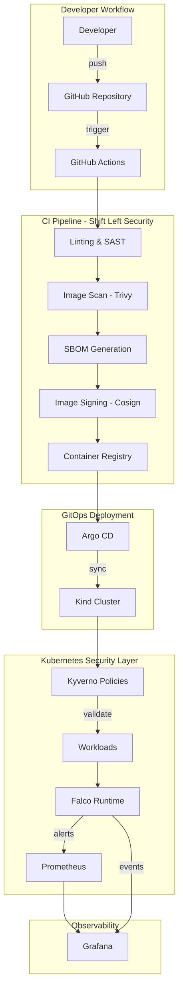

# Architecture Overview

## System Architecture



## Components

### Local Environment (Kind Cluster)
- **3-node cluster**: 1 control-plane, 2 workers
- **Ingress**: NGINX Ingress Controller
- **Port mappings**: 80 (HTTP), 443 (HTTPS), 30080 (Argo CD)

### Security Stack

| Component | Purpose | Port |
|-----------|---------|------|
| **Argo CD** | GitOps continuous delivery | 30080 |
| **Kyverno** | Admission control policies | - |
| **Falco** | Runtime security monitoring | - |
| **Sealed Secrets** | GitOps-compatible secrets | - |

### Observability

| Component | Purpose | Port |
|-----------|---------|------|
| **Prometheus** | Metrics collection | 9090 |
| **Grafana** | Dashboards & visualization | 30300 |

## Security Layers

```
┌─────────────────────────────────────────────────────────┐
│                     CI/CD Pipeline                       │
│  ┌──────────┐ ┌──────────┐ ┌──────────┐ ┌──────────┐   │
│  │ Linting  │→│  Trivy   │→│  SBOM    │→│ Signing  │   │
│  │ (SAST)   │ │ (Scan)   │ │ (Syft)   │ │ (Cosign) │   │
│  └──────────┘ └──────────┘ └──────────┘ └──────────┘   │
└─────────────────────────────────────────────────────────┘
                            ↓
┌─────────────────────────────────────────────────────────┐
│                   Admission Control                      │
│  ┌─────────────────────────────────────────────────┐   │
│  │                   Kyverno                        │   │
│  │  • Disallow privileged  • Require labels        │   │
│  │  • Require limits       • Require probes        │   │
│  │  • Restrict registries  • Verify signatures     │   │
│  └─────────────────────────────────────────────────┘   │
└─────────────────────────────────────────────────────────┘
                            ↓
┌─────────────────────────────────────────────────────────┐
│                   Runtime Security                       │
│  ┌─────────────────────────────────────────────────┐   │
│  │                    Falco                         │   │
│  │  • Shell detection      • Sensitive file access │   │
│  │  • Crypto mining        • Package manager use   │   │
│  │  • Network recon        • Container escape      │   │
│  └─────────────────────────────────────────────────┘   │
└─────────────────────────────────────────────────────────┘
```

## Data Flow

1. **Developer pushes code** → GitHub Actions triggered
2. **CI scans** → Trivy finds vulnerabilities, secrets
3. **Build & Sign** → Image pushed with Cosign signature + SBOM
4. **Argo CD syncs** → Deploys to Kind cluster
5. **Kyverno validates** → Blocks non-compliant workloads
6. **Falco monitors** → Detects runtime anomalies
7. **Prometheus/Grafana** → Visualizes security posture
